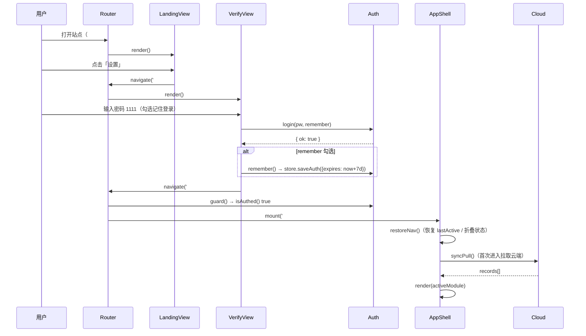
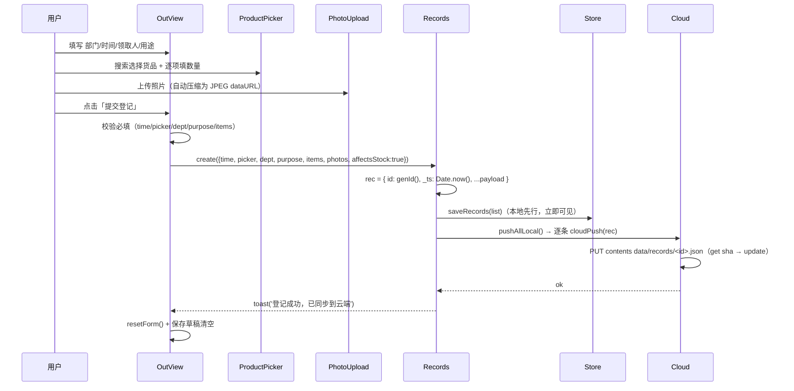
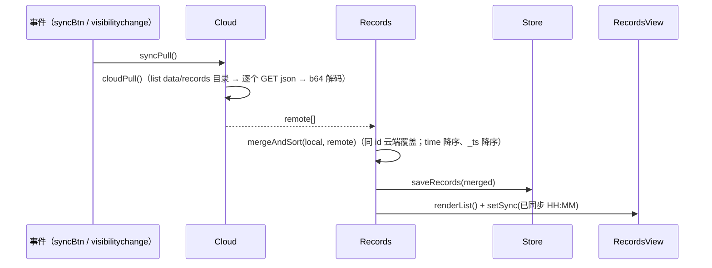
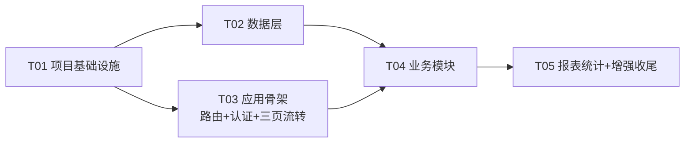

# 系统设计文档：出入库登记系统优化改版

> 版本：v1.0（Architect 产出）
> 项目：outbound-registry（GitHub Pages 静态站）
> 基础代码：commit 77bf632（src/index.html 1056 行单文件 + src/qrcode.js）
> 关联文件：docs/class-diagram.mermaid、docs/sequence-diagram.mermaid

---

## 0. 关键决策摘要（对应 PRD 待确认问题）

| # | 待确认问题 | 决策 |
|---|---|---|
| 1 | 出库登记是否需免密快捷入口？ | **不提供**。落地页仅保留"设置"按钮（遵循 PRD 原话），密码 1111 进入应用页 |
| 2 | 技术栈选择 | **Vanilla HTML/CSS/JS 模块化改造，无构建步骤、无新增依赖，不做 React 化**。理由见 §1 |
| 3 | 报表统计现状 | **从零新增**（现网代码无报表模块），复用 INVENTORY 快照 + getStock + 记录数据 |
| 4 | "不含原图内容"含义 | **待产品澄清**（见 §5）。本期假设：记录只存储压缩缩略图（JPEG dataURL），不保存/展示原始图片文件；列表缩略图 + 点击放大 |
| 5 | 密码策略 | 密码 1111；**连续 5 次失败锁定 60 秒**（前端计时，防误触非安全）；**记住登录有效期 7 天**（localStorage 时间戳） |
| 6 | 回退方案 | **提供 `?legacy=1` 应急回退**：冻结当前版本为 src/legacy.html，workflow 同时 perl 处理，P2 实施 |

---

# Part A：系统设计

## 1. 实现方案 + 框架选型

### 1.1 技术栈决策

**决策：Vanilla HTML/CSS/JS 模块化改造（多文件、无构建、无新依赖）。**

选型理由（按优先级）：

1. **部署链路零破坏是硬约束**。
   现有 `.github/workflows/deploy.yml` 仅对 `src/index.html` 做 `perl -pi -e 's/__GH_TOKEN__/$ENV{GH_TOKEN}/g'` 后拷贝到 `dist/index.html`。
   `window.__GH_TOKEN__ = "__GH_TOKEN__"` 必须留在 index.html 的**内联脚本**中才能被 perl 命中。
   若引入 Vite/React，该赋值会被打进**带 hash 的 JS chunk**，perl 只替换 index.html 将失效，必须改造 workflow 全量替换 dist 下所有 js —— 直接违背"部署链路不变"的 PRD 要求，且 token 注入失败 = 全站云端写入失效，风险不可接受。

2. **现有业务逻辑已经过线上验证**（出库/入库/库存计算/Contents API 同步/照片压缩/CSV 导出）。
   模块化搬迁（保留逻辑、拆分文件）比重写（React 化）风险低得多、交付快得多，契合"本期优先保证零破坏与交付速度"。

3. **无构建 = 无依赖树 = 无 supply-chain 风险**，对 GitHub Pages 静态站最稳；
   vanilla 无框架运行时，移动端（手机扫码为主）首屏更轻。

4. **兼容现网一切**：原 URL、二维码、data/records/*.json schema、localStorage key、GH_TOKEN 注入方式全部保持不变。

### 1.2 架构模式

轻量 **MVC 风格模块化**（非框架，经典 `<script>` 顺序加载 + 全局 `window.App` 命名空间）：

```
views/   视图层：落地页 / 验证页 / 应用壳 / 六大业务模块（渲染 + 用户交互）
data/    数据服务层：库存计算、云端同步（GH Contents API）、记录 CRUD/CSV
core/    配置（PRODUCTS/INVENTORY/GH/常量）、状态存取（localStorage）、通用工具
auth/    密码校验 / 失败锁定 / 记住登录 / 路由守卫
router/  hash 路由（#/、#/verify、#/app）+ 认证守卫
ui/      可复用组件：货品多选搜索、照片上传压缩、弹窗、Toast、折叠区块、SVG 图标
```

- 不用 ES Module（避免 file:// 调试跨域与加载顺序问题），采用 **IIFE + `window.App.*`** 模式；
  `index.html` 中脚本顺序固定，`main.js` 最后加载统一初始化。
- CSS 采用 **CSS 自定义属性设计令牌**（`base.css` 定义） + BEM 风格类名，三页风格一致。

### 1.3 核心难点与对策

| 难点 | 对策 |
|---|---|
| 零破坏（数据/部署/URL/二维码） | schema、localStorage key、GH dir 路径、`__GH_TOKEN__` 内联位置全部冻结；workflow 仅做"拷贝整个 src 目录"的等价扩展 |
| 三段式信息架构 | hash 路由 `#/` → `#/verify` → `#/app`；无 SPA fallback 需求；未登录访问 `#/app` 自动重定向 |
| 桌面式布局 + 移动抽屉 | `layout.css`：左侧导航（可折叠窄栏）+ 顶栏 + 内容区；≤768px 侧栏变抽屉（遮罩 + 滑入）；状态记忆侧栏开合 |
| 状态记忆 | `store.js` 统一管理 localStorage 键：导航激活项/折叠状态/表单草稿/搜索条件/记住登录 |
| 库存计算 | `INVENTORY` 快照 + `affectsStock=true` 增量计算逻辑**原样保留** |
| 云端同步 | GH Contents API（repo/branch/dir/token）逻辑原样保留；合并策略：同 id 云端覆盖本地；按 time 降序、_ts 降序 |
| 照片存储 | 保持现状：压缩为 JPEG dataURL（max 1280px / quality 0.72）写入记录 |

### 1.4 风险评估

| 风险 | 等级 | 缓解 |
|---|---|---|
| 拆分多文件后脚本加载顺序/全局命名冲突 | 中 | index.html 脚本顺序固定 + `window.App.*` 单一命名空间 + main.js 统一启动 |
| 无类型检查导致 schema 漂移 | 中 | 冻结 JSON schema（本文档 §3.2）+ 共享知识（§8）+ ?legacy=1 回退兜底 |
| workflow 改动引入部署问题 | 低 | T01 先行改 workflow 为 `cp -r src/. dist/`，提交后立即验证 Pages 部署成功再继续后续任务 |
| 重构中遗漏边缘逻辑 | 中 | 每个模块对照现网函数逐行搬迁；T05 提供 legacy 回退；手动回归清单 |

---

## 2. 文件列表

> 标记：`(M)` 修改 / `(A)` 新增 / `(K)` 保留不动

```
.github/workflows/deploy.yml              (M) 全量拷贝 src → dist；perl 同时处理 index.html 与 legacy.html
src/index.html                            (M) 三段式入口：__GH_TOKEN__ 内联占位 + 三视图容器 + 有序脚本加载 + ?legacy=1 检测
src/legacy.html                           (A) 冻结的旧版单文件（commit 77bf632 内容），?legacy=1 应急回退（P2）
src/qrcode.js                             (K) 本地内置 QR 生成库（MIT），保留；可选用于同步模块生成页面二维码
src/css/base.css                          (A) 设计令牌（CSS 变量）+ reset + 排版 + 按钮/表单基础样式
src/css/layout.css                        (A) 应用壳布局：侧栏/顶栏/内容区/抽屉式响应式/折叠
src/css/views.css                         (A) 落地页/验证页/六大模块页面级样式
src/js/main.js                            (A) 启动器：初始化 store → router → 认证守卫 → 首次同步 → 挂载视图
src/js/core/config.js                     (A) PRODUCTS / INVENTORY / GH / STORE_KEY / PASSWORD / 常量（冻结现网值）
src/js/core/store.js                      (A) localStorage 封装 + AppState + 导航/认证/草稿/搜索条件存取
src/js/core/util.js                       (A) esc / toast / modal / genId / nowLocal / b64 编解码 / 下载
src/js/data/stock.js                      (A) getStock（快照+增量）+ 库存汇总/排行/趋势（报表用）
src/js/data/cloud.js                      (A) GH Contents API：pull/push/delete/clearAll/syncPull/pushAllLocal
src/js/data/records.js                    (A) 记录 CRUD + 合并排序 + CSV 导出（对 STATE + localStorage + 云端编排）
src/js/auth/auth.js                       (A) 密码校验 / 5 次失败锁 60s / 记住登录 7 天 / isAuthed 守卫
src/js/router/router.js                   (A) hash 路由 #/ #/verify #/app + 守卫 + 变更监听
src/js/ui/components.js                   (A) ProductPicker / PhotoUpload / Modal / Confirm / Toast / CollapseSection / SVG 图标
src/js/views/landing.js                   (A) 落地页：品牌图标+标题+副标题+设置按钮
src/js/views/verify.js                    (A) 验证页：锁图标+密码输入+进入/返回+错误提示+记住登录
src/js/views/app.js                       (A) 应用壳：左侧导航+顶栏+内容区 + 模块注册表 + 状态记忆恢复
src/js/views/out.js                       (A) 出库登记模块（部门/时间/领取人/用途/货品多选+搜索+数量/照片/提交/清空/编辑）
src/js/views/in.js                        (A) 入库登记模块（货品多选+数量/用途来源/照片/确定入库/编辑）
src/js/views/stock.js                     (A) 库存查询模块（全货品库存列表 + 低阈值标记 P2）
src/js/views/records.js                   (A) 记录管理模块（列表/搜索筛选/详情/编辑/删除/清空/导出 CSV/立即同步）
src/js/views/report.js                    (A) 报表统计模块（出/入库汇总、库存排行、时间趋势）（P1）
src/js/views/sync.js                      (A) 云端同步模块（同步状态/立即同步/令牌信息/可选二维码）
```

---

## 3. 数据结构与接口

### 3.1 模块类图（完整版见 docs/class-diagram.mermaid）

```mermaid
classDiagram
    class Config {
        <<module>>
        +PRODUCTS: string[]
        +INVENTORY: Object~string, number~
        +GH: {repo, branch, dir, token}
        +STORE_KEY: string = "outbound_records_v2"
        +PASSWORD: string = "1111"
        +AUTH_KEY: string = "outbound_auth"
        +NAV_KEY: string = "outbound_nav"
        +AUTH_TTL_MS: number = 7*24*3600*1000
        +MAX_PW_FAILS: number = 5
        +PW_LOCK_MS: number = 60*1000
    }
    class Store {
        <<module>>
        +get(key): any
        +set(key, val): void
        +loadRecords(): Record[]
        +saveRecords(list): void
        +loadAuth(): AuthState|null
        +saveAuth(auth): void
        +loadNav(): NavState
        +saveNav(nav): void
        +loadDraft(name): Draft|null
        +saveDraft(name, draft): void
        +loadSearch(): SearchState
        +saveSearch(s): void
    }
    class AppState {
        +list: Record[]
        +lastSync: Date|null
        +nav: NavState
        +activeModule: string
    }
    class Stock {
        <<module>>
        +getStock(name, list): number
        +summarize(list): {name, stock, inQty, outQty}[]
        +trend(list, days): {date, outQty, inQty}[]
    }
    class Cloud {
        <<module>>
        +token: string
        +pull(): Promise~Record[]~
        +push(rec): Promise~void~
        +delete(id): Promise~void~
        +clearAll(): Promise~void~
        +syncPull(): Promise~void~
        +pushAllLocal(): Promise~{ok, fail}~
    }
    class Records {
        <<module>>
        +create(rec): Record
        +update(id, patch): Record
        +remove(id): void
        +clear(): void
        +mergeAndSort(local, remote): Record[]
        +exportCsv(): void
    }
    class Auth {
        <<module>>
        +isAuthed(): boolean
        +login(pw, remember): {ok, err?}
        +logout(): void
        +lockUntil: number
        +remainingLock(): number
    }
    class Router {
        <<module>>
        +routes: Object
        +current: string
        +navigate(hash): void
        +start(): void
        +guard(): boolean
    }
    class AppShell {
        +navItems: NavItem[]
        +render(): void
        +mount(moduleName): void
        +toggleSidebar(): void
        +restoreNav(): void
    }
    class ProductPicker {
        +selected: {name, qty}[]
        +attach(container): void
        +render(): void
    }
    class PhotoUpload {
        +photos: {src, name}[]
        +attach(container): void
        +compress(dataUrl): void
        +render(): void
    }
    class Modal { +show(title, body): void; +hide(): void }
    class Toast { +show(msg, isErr): void }
    class LandingView { +render(): void }
    class VerifyView { +render(): void; +onSubmit(): void }
    class OutView { +render(): void; +submit(): void; +reset(): void }
    class InView { +render(): void; +submit(): void; +reset(): void }
    class StockView { +render(): void }
    class RecordsView { +render(): void; +filter(list): Record[]; +detail(id): void }
    class ReportView { +render(): void }
    class SyncView { +render(): void; +doSync(): void }

    Store --> Config : keys from
    AppState --> Store : hydrated from
    Stock --> Config : INVENTORY
    Stock --> AppState : reads list
    Cloud --> Config : GH
    Records --> Store
    Records --> Cloud
    Records --> AppState
    Auth --> Store
    Router --> Auth : guard #/app
    AppShell --> Router
    AppShell --> OutView
    AppShell --> InView
    AppShell --> StockView
    AppShell --> RecordsView
    AppShell --> ReportView
    AppShell --> SyncView
    OutView --> ProductPicker
    OutView --> PhotoUpload
    OutView --> Records
    InView --> ProductPicker
    InView --> PhotoUpload
    InView --> Records
    RecordsView --> Records
    RecordsView --> Modal
    RecordsView --> Toast
    StockView --> Stock
    ReportView --> Stock
    SyncView --> Cloud
    LandingView --> Router
    VerifyView --> Auth
    VerifyView --> Router
```

### 3.2 记录 JSON Schema（**冻结，不得变更**）

```jsonc
{
  "id": "string",              // genId(): Date.now().toString(36) + 5位随机
  "time": "string",            // "YYYY-MM-DDTHH:mm"（datetime-local）
  "picker": "string",          // 领取人（出库必填；入库无此字段）
  "dept": "string",            // 部门/领取单位（出库必填；入库无此字段）
  "purpose": "string",         // 出库=用途/项目；入库=用途/来源
  "items": [ { "name": "string", "qty": "number" } ],
  "photos": [ "data:image/jpeg;base64,..." ],   // 压缩 dataURL 数组
  "_ts": "number",             // Date.now() 修改时间戳
  "affectsStock": "boolean",   // true=参与库存增量计算（新记录）；旧记录无此字段/非 true
  "type": "'in' | undefined"   // 'in'=入库记录；缺省=出库记录
}
```

### 3.3 localStorage 键表

| 键 | 内容 | 兼容 |
|---|---|---|
| `outbound_records_v2` | 记录数组（AppState.list） | 保留不动 |
| `gh_token` | 云端令牌兜底 | 保留不动 |
| `outbound_dept_history` | 部门历史（自动补全） | 保留不动 |
| `outbound_picker_history` | 领取人历史（自动补全） | 保留不动 |
| `outbound_auth` | `{ expires }` 记住登录（7 天） | 新增 |
| `outbound_nav` | `{ active, sidebarCollapsed, moduleCollapse: {} }` | 新增 |
| `outbound_draft_out` | 出库表单草稿 | 新增 |
| `outbound_draft_in` | 入库表单草稿 | 新增 |
| `outbound_search` | 记录搜索/筛选条件 | 新增 |

### 3.4 状态对象

```js
AppState = {
  list: Record[],          // 由 store.loadRecords() 初始化
  lastSync: Date|null,
  nav: { active: 'out', sidebarCollapsed: false, moduleCollapse: {} }
}
AuthState = { expires: number }        // 记住登录过期时间戳（ms）
Draft = { time, picker, dept, purpose, items, photos }   // 表单草稿
SearchState = { q: '', dept: '', picker: '', type: '', from: '', to: '' }
```

---

## 4. 程序调用流程（完整版见 docs/sequence-diagram.mermaid）

### 4.1 三页流转（落地 → 验证 → 应用）



### 4.2 出库登记提交 + 云端同步



### 4.3 云端拉取同步（手动 / visibilitychange 触发）



---

## 5. 待明确事项（需产品/用户确认）

1. **"不含原图内容"含义**：PRD 原文未展开。本期假设 = 记录中只保存压缩缩略图（JPEG dataURL，现网已如此），列表/详情只展示缩略图，点击放大；**不**保存/展示原始图片文件。请产品确认是否另有他意。
2. **报表统计口径**：从零新增。建议口径 = ①出/入库汇总（总量、次数、货品数）；②货品库存排行（按当前库存降序）；③时间趋势（近 7/30 天按日聚合出/入库数量）。是否满足？是否需要周/月维度？
3. **密码失败锁定策略**：连续 5 次失败锁定 60 秒（纯前端计时，仅防误触，非安全措施）。是否可接受？若需更强可做指数退避（不建议，静态站无后端）。
4. **legacy 回退入口**：默认提供 `?legacy=1`（冻结当前版本为 legacy.html）。是否保留？保留则 T05 实施。
5. **记住登录 7 天**：默认 7 天（localStorage 时间戳）。是否需要调整？

---

# Part B：任务分解

## 6. 所需依赖包

**无新增第三方依赖。**

- `src/qrcode.js`：本地内置 QR 生成库（MIT 许可，Kazuhiko Arase），保留原文件，可选用于同步模块展示页面二维码。
- 无 npm 依赖、无构建工具。

---

## 7. 任务列表（按依赖排序，共 5 个任务）

### T01 项目基础设施（P0）
- **文件**：`.github/workflows/deploy.yml`(M)、`src/index.html`(M)、`src/css/base.css`(A)、`src/js/core/config.js`(A)、`src/js/core/util.js`(A)、`src/js/main.js`(A)
- **依赖**：无
- **内容**：
  - workflow：改为 `mkdir -p dist && cp -r src/. dist/` 全量拷贝；perl 替换同时作用于 `src/index.html` 与 `src/legacy.html`（`perl -pi -e 's/__GH_TOKEN__/$ENV{GH_TOKEN}/g' src/index.html src/legacy.html`）
  - index.html：三段视图容器（`#view-landing` / `#view-verify` / `#view-app`）+ 内联 `window.__GH_TOKEN__ = "__GH_TOKEN__"`（**必须保持内联，供 perl 替换**）+ 有序 `<script>` 加载全部 js + `?legacy=1` 检测跳转 legacy.html
  - base.css：设计令牌（颜色/间距/圆角/阴影/字体）、reset、按钮/表单/卡片基础样式
  - config.js：冻结 PRODUCTS（20 项）、INVENTORY（19 项快照）、GH（repo/branch/dir/token 逻辑）、STORE_KEY、PASSWORD=1111、认证/锁定常量
  - util.js：esc / toast / modal / genId / nowLocal / b64enc / b64dec / download
  - main.js：启动器（store→router→首次同步→视图挂载），模块未就绪时占位渲染
- **验收**：`cp -r src/. dist/` 后 dist 结构完整；index.html 含 `__GH_TOKEN__` 占位符；脚本按序加载无报错；提交后 Pages 部署成功（workflow 改动立即验证）

### T02 数据层（P0）
- **文件**：`src/js/core/store.js`(A)、`src/js/data/stock.js`(A)、`src/js/data/cloud.js`(A)、`src/js/data/records.js`(A)
- **依赖**：T01
- **内容**：原样搬迁现网数据逻辑
  - store.js：localStorage 封装 + AppState + 认证/导航/草稿/搜索存取
  - stock.js：`getStock(name)` = INVENTORY[name] + Σ(affectsStock===true 且 type==='in' ? +qty : -qty)；summarize/trend（报表用）
  - cloud.js：cloudPull / cloudPush / cloudDelete / cloudClearAll / syncPull / pushAllLocal（GH Contents API 全量搬迁）
  - records.js：create/update/remove/clear + mergeAndSort（同 id 云端覆盖；time 降序、_ts 降序）+ exportCsv（带 BOM）
- **验收**：getStock 与现网输出一致；cloud 函数与现网行为一致；schema 不变；本地+云端合并排序正确

### T03 应用骨架：路由 + 认证 + 三页流转（P0）
- **文件**：`src/js/router/router.js`(A)、`src/js/auth/auth.js`(A)、`src/js/views/landing.js`(A)、`src/js/views/verify.js`(A)、`src/js/views/app.js`(A)、`src/css/layout.css`(A)
- **依赖**：T01（对数据层仅引用 stub，T04 填充模块）
- **内容**：
  - router.js：hash 路由 `#/`、`#/verify`、`#/app` + hashchange 监听 + guard
  - auth.js：login（1111）/ 失败计数（5 次锁 60s）/ remember（7 天）/ logout / isAuthed
  - landing.js：品牌图标 + 标题"出入库登记表" + 副标题 + 「设置」主按钮（渐变/阴影/悬浮动效）+ 页脚
  - verify.js：锁图标 + "设置访问" + 密码输入（回车提交）+ 进入/返回 + 红色可消失错误提示 + 记住登录勾选
  - app.js：应用壳（左侧导航 6 项 + 顶栏 汉堡/标题/同步状态/返回 + 内容区）+ 模块注册表（T04 注册）+ 状态记忆恢复（导航/折叠）
  - layout.css：应用壳布局 + ≤768px 抽屉式侧栏 + 折叠窄栏
- **验收**：`#/` → 设置 → `#/verify` → 1111 → `#/app`；错误密码提示；未登录访问 `#/app` 重定向到 `#/verify`；记住登录 7 天有效；侧栏+顶栏+内容区布局与抽屉响应式；模块注册表可挂载占位模块

### T04 业务模块（P0）
- **文件**：`src/js/ui/components.js`(A)、`src/css/views.css`(A)、`src/js/views/out.js`(A)、`src/js/views/in.js`(A)、`src/js/views/stock.js`(A)、`src/js/views/records.js`(A)、`src/js/views/sync.js`(A)
- **依赖**：T02、T03
- **内容**：
  - components.js：ProductPicker（搜索+多选+数量+库存显示）、PhotoUpload（压缩+缩略图+删除）、Modal、Confirm、Toast、CollapseSection、SVG 图标
  - out.js：出库登记全能力（部门/领取单位、领取时间、领取人、用途/项目、货品多选+搜索+数量、现场照片多张、提交/清空/编辑）+ 草稿记忆
  - in.js：入库登记全能力（货品多选+数量、用途/来源、照片、确定入库/编辑）+ 草稿记忆
  - stock.js：库存查询（全货品 getStock 列表，可折叠区块）
  - records.js：记录管理（列表/搜索筛选：部门/领取人/货品名/时间范围/详情弹窗/编辑/删除/清空/导出 CSV/立即同步）；管理操作均过密码
  - sync.js：云端同步（同步状态/立即同步/令牌可用性提示/可选二维码）
  - views.css：各模块页面级样式
- **验收**：与现网功能逐项对齐（提交/清空/编辑/入库/库存/列表/详情/删除/清空/导出/同步）；搜索筛选生效；密码保护管理操作；移动端可操作

### T05 报表统计 + 增强收尾（P1）
- **文件**：`src/js/views/report.js`(A)、`src/legacy.html`(A)、`src/js/main.js`(M)、`src/js/views/records.js`(M，完善搜索筛选)、`src/js/core/store.js`(M，草稿/搜索条件键)
- **依赖**：T04
- **内容**：
  - report.js：报表统计（出/入库汇总、货品库存排行、时间趋势近 7/30 天，纯前端基于 STATE.list + getStock）
  - legacy.html：冻结 commit 77bf632 单文件内容（含 `__GH_TOKEN__` 占位符，workflow perl 已覆盖）
  - main.js 联调接线 + 全流程回归；store/records 完善草稿与搜索条件记忆
- **验收**：报表三块正确渲染；`?legacy=1` 打开旧版可正常同步；手动回归清单全绿（落地/验证/出库/入库/库存/记录/同步/移动端）

---

## 8. 共享知识（跨文件约定）

- **Token 注入**：`window.__GH_TOKEN__ = "__GH_TOKEN__"` 必须保持为 index.html **内联脚本**（workflow perl 只替换 html 文本中的占位符）。任何情况下不得将其移入外部 js / 压缩产物。
- **记录 schema 冻结**：`{id, time, picker?, dept?, purpose, items:[{name,qty}], photos:[dataURL], _ts, affectsStock, type?}`，不得增删字段、不得改类型。
- **库存计算**：`getStock(name) = INVENTORY[name] + Σ(affectsStock===true && type==='in' ? +qty : -qty)`；旧记录（无 affectsStock=true）不参与计算，已包含在 INVENTORY 快照中。
- **云端合并策略**：同 id 时云端覆盖本地；排序 = `time` 降序，次 `_ts` 降序（与现网一致）。
- **密码**：默认 1111；连续 5 次失败锁定 60 秒（前端计时）；记住登录 = `outbound_auth` 存 `{expires: now+7d}`，`isAuthed()` 校验过期。
- **localStorage 键**：数据键 `outbound_records_v2`、令牌兜底 `gh_token`、历史 `outbound_dept_history` / `outbound_picker_history` **不得改名**；新增键统一经 `store.js` 常量管理。
- **ID 生成**：`genId() = Date.now().toString(36) + Math.random().toString(36).slice(2,7)`（与现网一致，保证云文件不冲突）。
- **照片**：上传即压缩为 JPEG dataURL（max 1280px / quality 0.72），存记录；列表展示缩略图，点击放大。
- **路由**：hash 路由（`#/`、`#/verify`、`#/app`）；index.html 恒为入口；无 SPA fallback。
- **脚本组织**：经典 `<script>` 顺序加载（不用 ES Module），所有模块挂 `window.App.*`；`main.js` 最后加载统一初始化。
- **XSS**：所有用户数据经 `esc()` 转义后 innerHTML 渲染；onclick 绑定使用闭包/事件委托，避免内联字符串拼接注入。
- **命名**：CSS 类 BEM 风格（`.app-nav__item--active`）；视图模块导出 `render(container)`；数据模块纯函数式导出。
- **文案**：全部中文，与现网保持一致（如"提交登记""确定入库"等）。

---

## 9. 任务依赖图



- T02 与 T03 在 T01 后可并行（T02 纯数据、T03 纯骨架，互不阻塞）。
- T04 需 T02+T03 齐备后开始（业务模块同时依赖数据层与应用壳）。
- T05 最后收尾（报表 + legacy 回退 + 联调回归）。
