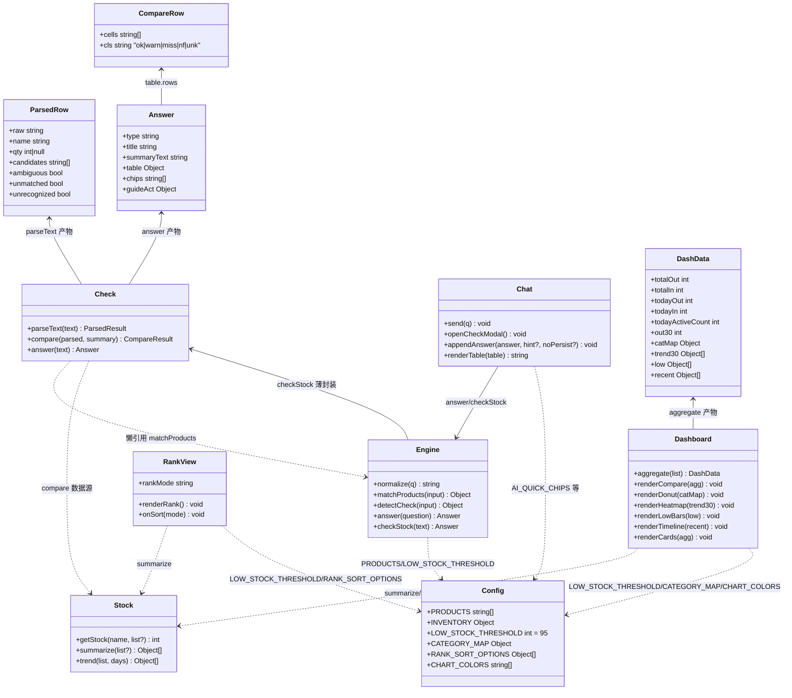
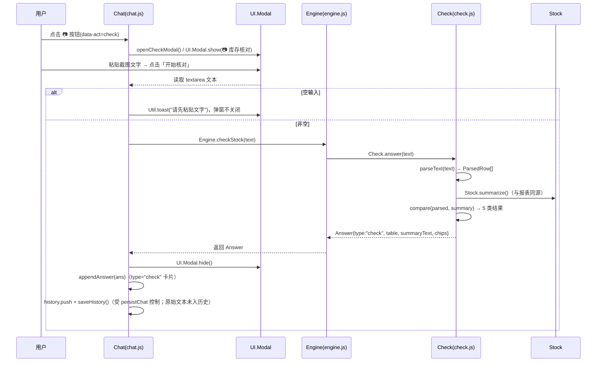
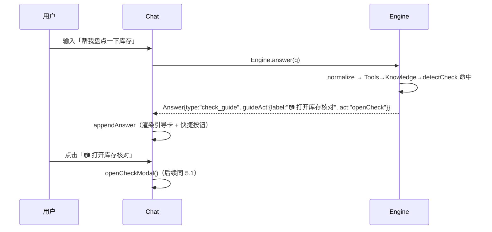
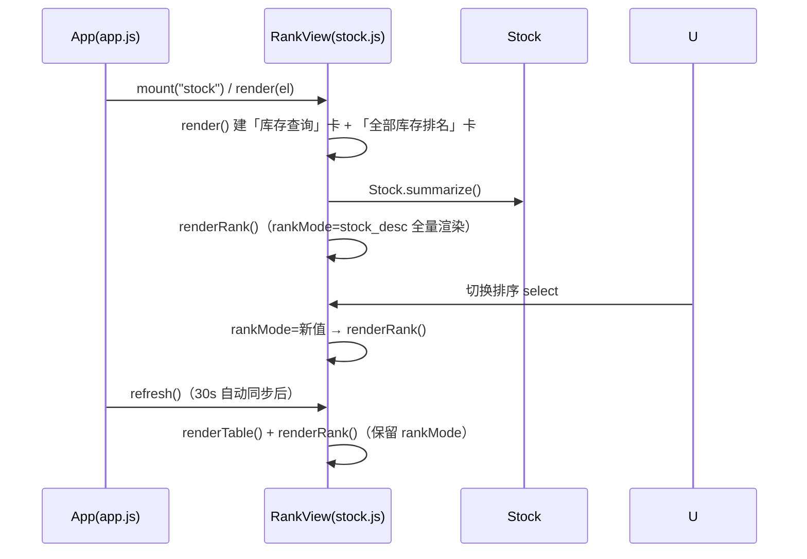
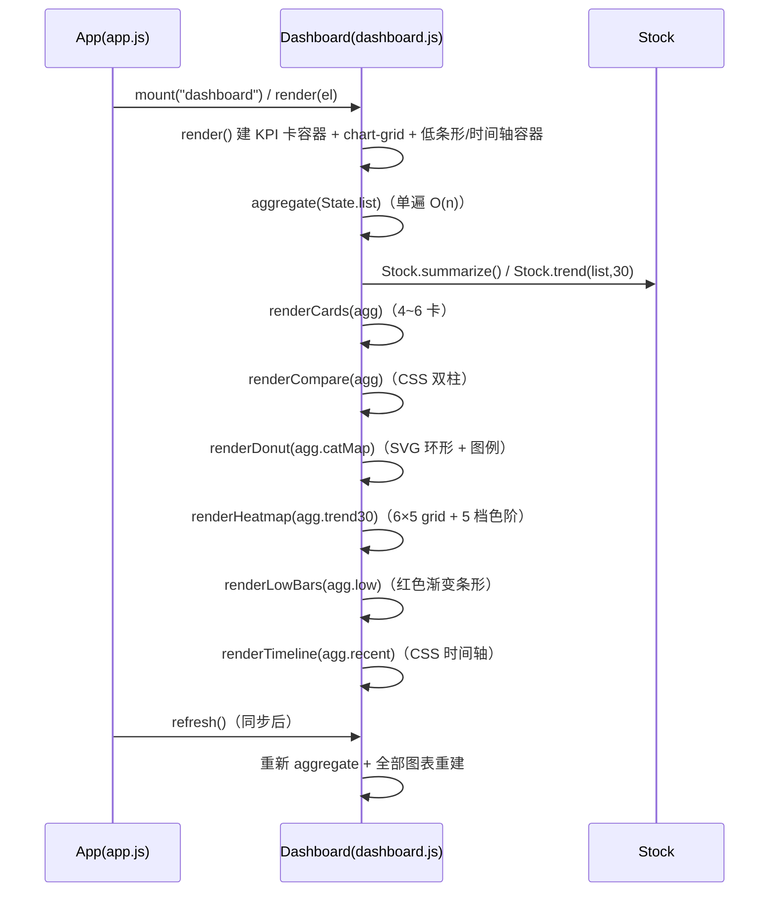
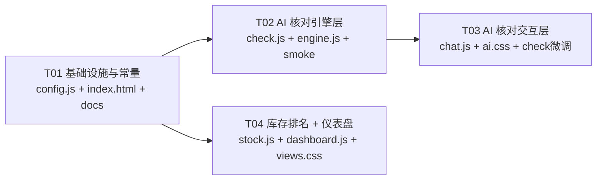

# 系统设计文档 v6.0 — AI 库存核对 + 库存全量排名 + 仪表盘可视化

> 版本：v6.0（第六轮增量）｜作者：Bob（Architect）｜状态：待 Engineer 实施
> 仓库：chenliguan42057/outbound-registry｜基线：remote main = d52e982（已含 v5）
> 上游依据：PRD_v6_库存核对排名可视化.md（374 行）+ 主理人 8 项决策（全部采纳）
> 关联文件：docs/class-diagram-v6.mermaid、docs/sequence-diagram-v6.mermaid、docs/check-smoke.md（T02 产出）

---

## 0. 关键决策摘要（对应 PRD §5 待确认 + 主理人 8 项决策）

| # | 待确认事项 | 决策（已确认） |
|---|---|---|
| 1 | AI 核对结果是否保存进会话历史 | **保存**：check 结果 Answer 走 appendAnswer 常规路径进内存历史 + outbound_ai_chat 持久化（受 persistChat 开关控制）；**原始粘贴文本绝不落盘**（不进历史、不写 localStorage、不入云端） |
| 2 | 库存排名分页 / 「只看低库存」过滤 | **不做**：20 个货品全量展示，无分页；「只看低库存」→ P1 预留（本期零实现） |
| 3 | 仪表盘图表组合 | **4 P0 + 2 P1**：出入库对比柱状图、库存分布环形图（SVG）、近 30 天出库热力日历、低库存横向条形 = P0；近期活动时间轴 + KPI 卡增强 = P1 |
| 4 | 环形图类目归组 | **8 大类 CATEGORY_MAP**（放 config.js，见 §4.3）；未命中类目兜底归「其他」 |
| 5 | 核对数量容差 | **严格一致**（数量不等即 ⚠️），无 ± 容差；容差设置 P2 不做 |
| 6 | 行内无数量（只核存在性） | **支持**：行无数量 → 仅比对「系统是否有此货品」，不比较数量 |
| 7 | 低库存阈值 | **沿用 Config.LOW_STOCK_THRESHOLD = 95**（排名/图表/核对统一） |
| 8 | 📷 按钮放置 | **聊天面板单例双入口**：落地页浮动面板 + 管理后台 #/app/ai 内嵌面板天然共用（chat.js 单例，无需环境判断） |

**架构级新增决策（本设计补充，PRD 未强制）**：
- D-1 热力日历布局采用「**6 列 × 5 行 = 30 格**，每格 = 一天，按日期顺序逐行排布，格内显示日号」；5 档色阶按当窗最大值相对分档（0 → 1~20% → 21~40% → 41~60% → 61~100%）。PRD 线框中的「一二三四五六日」表头为示意，6×5 布局无法对齐 7 日星期表头，故采用日号标签 + 日期范围标题（信息量更大且严格满足 6×5）。
- D-2 check.js 对 matchProducts 采用**懒引用** `window.App.AI.Engine.matchProducts`（check.js 脚本顺序在 engine.js 之前，运行时才调用，无循环依赖）。
- D-3 引导卡片快捷按钮用 `answer.guideAct = {label, act:"openCheck"}` 字段承载（engine 保持纯数据，chat.js 负责 DOM），避免把 DOM 逻辑渗入引擎。
- D-4 排名名称排序用 `localeCompare("zh-Hans-CN")`（现代浏览器支持；异常时 catch 回落码点比较）。

---

# Part A：系统设计

## 1. 增量实现方案

### 1.0 总体技术路线（延续 v1~v5，零新增依赖）

- 继续 **Vanilla HTML/CSS/JS IIFE + `window.App.*` 命名空间 + 经典 `<script>` 顺序加载**，无构建、无 npm、无第三方库。
- 图表一律**纯 CSS / 原生 SVG**；AI 核对一律**纯前端字符串解析**。
- 数据源**只读复用** `State.list` + `Stock.summarize()` + `Stock.trend()` + `Config.PRODUCTS/INVENTORY/LOW_STOCK_THRESHOLD`，与报表/库存查询同源同数字。
- 部署链路、localStorage 冻结键、data/records/*.json schema、`__GH_TOKEN__` 注入全部**零改动**。

### 1.1 需求 1：AI 库存核对

#### 1.1.1 核心难点与对策

| 难点 | 对策 |
|---|---|
| 浏览器无 OCR | 落地为**文本粘贴模式**（PRD 技术约束）。📷 按钮保留「截图」心智，弹窗明确引导「从截图复制文字后粘贴」+ 明示「识别的是文字不是图片」 |
| 零新增第三方依赖 | check.js 纯函数自写解析；图表零依赖 |
| 截图文字噪音大（空白行/装饰符/全半角标点/单位后缀/表格粘贴） | 逐行归一化（trim → 去行首装饰符 → 空行丢弃）；核心正则容忍全/半角分隔符与可选单位后缀；含 `\t` 的行按表格粘贴取「最后一列数字」为数量 |
| 产品名歧义不静默错判 | 复用 Engine.matchProducts（exact 精确 + fuzzy 模糊）；exact=1 → 唯一；exact>1 或 fuzzy 多候选 → 全部列出 + 行标记「名称不唯一」 |
| 数据隐私 | 粘贴文本只进内存 parseText 局部变量；结果 Answer 才进历史；原始文本任何路径不落盘 |
| 与 v5 路由零冲突 | detectCheck 触发词（核对/盘点/清点等）与产品名、KB 关键词、既有意图词无交集；插入 Tools 之后、产品匹配之前，命中即返回，不抢占既有意图 |

#### 1.1.2 check.js 解析算法（parseText，纯函数）

```
输入 text → split(/\r?\n/) 逐行：
  step1 行归一化：trim → 去行首装饰符 /^[|｜·●\-—\s]+/ → 去行尾 /[|｜\s]+$/ → 空行丢弃（计入 ignored）
  step2 表格粘贴（含 \t）：按 \t 切分，从右向左找第一个纯数字 cell 作为 qty，其余非数字 cell join 为货品名候选
  step3 常规行匹配：/^(.+?)[\s:：,，、|　\t]+(\d+(?:\.\d+)?)\s*(?:件|个|盒|支|瓶|袋|片|g|ml|瓶装)?\s*$/
        m[1]=货品名候选；m[2]=数量
  step4 数量校验：1 ≤ qty ≤ 99999，越界 → 行标 unrecognized（⚪，保留原文）
  step5 无数量行（正则未命中且非表格）：qty=null → 只核存在性（决策6）
  step6 产品匹配：Engine.matchProducts(normalize(货品名候选))
        exact.length===1 → candidates=[exact[0]], ambiguous=false
        exact.length>1    → candidates=exact, ambiguous=true
        exact.length===0 && fuzzy.length>0 → candidates=fuzzy, ambiguous=true
        无命中 → candidates=[], unmatched=true
输出：{ rows:[{raw, name, qty, candidates, ambiguous, unmatched, unrecognized}], ignored }
```

#### 1.1.3 比对算法（compare(parsed, summary)）

```
系统侧 map = {name → stock}（来自 Stock.summarize()，与报表同源）
for 每个 parsed row：
  candidates 为空 → 结果行 not_found（❌ 系统无此货品，名称=原文）
  candidates 非空 → 对每个候选（歧义则多行并列，标同名候选）：
    sys = map[candidate]
    qty == null        → ok（✅ 存在，不比较数量）
    qty === sys        → ok（✅ 一致）
    qty !== sys        → mismatch（⚠️ 数量不符，显示 系统X vs 截图Y + 差量）
系统侧未被任何候选命中的货品 → missed（🔵 截图未提及）
unrecognized 行 → ⚪ 无法识别（保留原文）
汇总：total / ok / mismatch / missed / notFound / unrecognized
```

#### 1.1.4 Answer 对象（type="check"）

```js
{
  type: "check",
  title: "📋 库存核对结果（共 N 项）",
  summaryText: "共比对 N 项：✅一致 a ｜ ⚠️数量不符 b ｜ 🔵截图未提及 c ｜ ❌系统无 d ｜ ⚪无法识别 e 行",
  table: {
    head: ["货品名称", "系统库存", "截图数量", "结果"],
    rows: [{ cells: [...], cls: "ok|warn|miss|nf|unk" }]   // cls 供 chat.js 着色
  },
  chips: ["哪些货品低库存？", "今天出了多少货？", "重新核对"]
}
```

#### 1.1.5 engine.js 变更点

| 变更 | 说明 |
|---|---|
| 顶部捕获 | `var Check = window.App.AI && window.App.AI.Check ? window.App.AI.Check : null;`（与 Tools/Knowledge 同款；脚本顺序保证 check.js 在 engine.js 前） |
| 新增 `CHECK_TRIGGER` | `/(库存.*(?:核对|对不上|盘点|清点))|((?:核对|盘点|清点|对一下|比较).*(?:库存|货))|^(?:核对|盘点|清点)$/` |
| 新增 `detectCheck(input)` | 命中返回 `{type:"check_guide", title:"📋 库存核对", text:引导文案, guideAct:{label:"📷 打开库存核对", act:"openCheck"}, chips:[...]}`；未命中返回 null |
| 路由链插入 | answer() 中 **Tools → Knowledge → detectCheck（新）→ detectWiki → 产品匹配 → detectIntent → detectWeb → fallback**（PRD 指定 Tools 之后、产品匹配之前；放 Knowledge 之后避免 KB 吞触发词，实际两者无交集，取 Knowledge 后更稳妥） |
| 暴露 `checkStock(text)` | 薄封装：`Check ? Check.answer(text) : 兜底错误 Answer`；不经过 normalize（粘贴文本要保留原始分隔符） |

#### 1.1.6 chat.js 变更点

| 变更 | 说明 |
|---|---|
| ai-inputbar 新增按钮 | 发送按钮左侧 `<button type="button" class="ai-hbtn ai-check-btn" data-act="check" title="库存核对">📷</button>` |
| panel click 事件 | ① `data-act="check"` → `openCheckModal()`；② `[data-act="openCheck"]`（引导卡按钮）→ `openCheckModal()`；③ chip 文本 === "重新核对" → `openCheckModal()`（其余 chip 仍 send） |
| `openCheckModal()` | `UI.Modal.show("📷 库存核对", body, {width:"420px"})`；body = 引导文案（"从截图复制文字后粘贴，本功能识别的是文字，不是图片"）+ textarea + 示例文案 + [取消]/[开始核对]；开始核对：空输入 → `Util.toast("请先粘贴文字", true)` 不关弹窗；非空 → `Engine.checkStock(text)` → `UI.Modal.hide()` → `appendAnswer(ans)` |
| `appendAnswer` 扩展 | ① 支持 `answer.guideAct` → 气泡内渲染 `<button class="ai-chip" data-act="openCheck">📷 打开库存核对</button>`；② `answer.type === "check"` 时渲染 summaryText 徽章行 + 表格（renderTable 增加 `r.cls` → `<tr class="ck-{cls}">`） |

#### 1.1.7 隐私红线（写死约束）

- 粘贴文本仅存在于 `openCheckModal` → `Engine.checkStock(text)` → `Check.parseText` 的**局部变量/内存对象**。
- 原始文本**不** push 进 history、**不** `Store.saveAiChat`、**不**进任何 `answer.text`。
- check 结果 Answer（含货品名/数量/分类）按常规 AI 回复进历史（决策1 允许）。

### 1.2 需求 2：库存全量排名

#### 1.2.1 位置与结构（stock.js）

- **不动现有搜索表格**（硬约束零破坏）。在现有 `.card` 之后追加第二张 `.card`：

```
┌─ 全部库存排名 ──────────────────────────────┐
│ 排序：[库存 多→少 ▾]                          │
│ ┌────┬────────────────────┬──────┬────────┐ │
│ │排名 │ 货品名称           │当前库存│ 状态    │ │
│ │ 1  │ 冻干精华液 5支装    │ 320  │ 正常    │ │
│ │ …  │ …                  │ …    │ …      │ │
│ │ 19 │ 冻干精华液 30支装   │ 42   │ 🔴低库存 │ │
│ └────┴────────────────────┴──────┴────────┘ │
└─────────────────────────────────────────────┘
```

- 排序状态：模块级 `var rankMode = "stock_desc"`（不持久化，页面重进回到默认）。
- 排序模式来自 `Config.RANK_SORT_OPTIONS`（原生 `<select>`）：
  - `stock_desc` 库存多→少（默认）、`stock_asc` 少→多、`name_asc` A→Z、`name_desc` Z→A。
- `renderRank()`：`Stock.summarize()` → 按模式排序 → 全量渲染；排名序号动态编号；`s.stock < Config.LOW_STOCK_THRESHOLD` → `<tr class="low-stock">` + 库存数字 `danger-text` + `<span class="tag danger-tag">低库存</span>`；复用 `.table/.table-wrap/.low-stock/.tag/.danger-tag/.ok-tag` 既有类。
- `refresh()` 追加 `renderRank()`（保留当前 rankMode）；搜索框 input 只重绘原表格，不重绘排名（互不干扰）。

#### 1.2.2 边界

- summary 为空 → `<div class="empty">暂无数据</div>`。
- 名称排序：`localeCompare("zh-Hans-CN")`，try/catch 回落 `a.name < b.name ? -1 : 1`。

### 1.3 需求 3：仪表盘可视化

#### 1.3.1 页面结构（dashboard.js 新版 render()）

```
dash-cards（4 KPI 卡；P1 扩到 6 卡：+今日活跃领取人数 +近30天出库总量）
chart-grid（3 列：出入库对比柱 | 库存分布环形 | 近30天出库热力）
grid2（2 列：低库存横向条形 | 近期活动时序）
grid2（保留：低库存预警列表 | 最近出库）
```

#### 1.3.2 聚合函数（单遍 O(n)）

```js
function aggregate(list) {
  var summary = Stock.summarize();          // 复用一次（卡片/环形/低条形共用）
  var low = summary.filter(s => s.stock < Config.LOW_STOCK_THRESHOLD).sort(asc);
  var totalOut = 0, totalIn = 0, todayOut = 0, todayIn = 0;
  var todayActive = {};                     // 今日活跃领取人集合（出库记录的 picker 去重）
  list.forEach(r => {                       // 单遍
    if (r.affectsStock !== true) return;
    var q = sum(items.qty);
    if (r.type === "in") totalIn += q; else totalOut += q;
    if (r.time.slice(0,10) === today) {
      if (r.type === "in") todayIn += q; else { todayOut += q; if (r.picker) todayActive[r.picker] = 1; }
    }
  });
  var trend30 = Stock.trend(list, 30);      // 热力 + 近30天出库总量
  var out30 = trend30.reduce((s,d) => s + d.outQty, 0);
  var catMap = catAggregate(summary, Config.CATEGORY_MAP);
  var recent = list.slice(0, 10);           // 近期活动时间轴（出入库混合）
  return { summary, low, totalOut, totalIn, todayOut, todayIn,
           todayActiveCount: Object.keys(todayActive).length,
           trend30, out30, catMap, recent };
}
```

#### 1.3.3 各图表实现细节

| 图表 | 数据源 | 视觉实现 | 关键代码点 |
|---|---|---|---|
| **出入库对比柱状图**（P0） | totalOut / totalIn | 纯 CSS flex：两根 `.compare-col`，高度 = `qty/max*100%`；出=紫 #6366F1、入=绿 #10B981；柱顶数字 + 图例 | `height` 用百分比 + `min-height:2%` 防零柱消失；底部标签「总出库/总入库」 |
| **库存分布环形图**（P0） | catMap | 原生 SVG：`<circle>` + `stroke-dasharray` 分段圆弧；r=40、stroke-width=18、viewBox="0 0 100 100"；中心 `<text>` 显示总库存；右侧/下方图例（色块+类目+数量+占比） | 每段 `dasharray = frac*C + " " + C`、`dashoffset` 累加、`transform="rotate(-90 50 50)"`；颜色取 `Config.CHART_COLORS[i%8]`；catMap 无值类目跳过；全部为 0 → 显示「暂无库存」占位 |
| **近 30 天出库热力日历**（P0） | trend30 | CSS grid：`repeat(6, 1fr)` = 30 格，每格一天（日期顺序逐行排布，格内显示日号）；5 档色阶 `heatmap-t0..t4`；`title="M/D：N 件"`；卡片标题「近 30 天出库热力（M/D–M/D）」 | 分档：`qty===0→0`；否则 `1 + min(4, floor(qty/max*5))`；色阶 `["#F1F0FF","#DDD6FE","#A5B4FC","#818CF8","#6366F1"]`；手机端 `.chart-scroll` 横向滚动 |
| **低库存横向条形**（P0） | low（前 8） | 复用 report.js 的 `.rank-row/.rank-bar/.rank-bar-fill`，fill 用红色渐变 `linear-gradient(90deg,#F87171,#F04438)`；右侧数值 | 与下方「低库存预警列表」同源不同形态：此卡=可视化条形，预警列表=明细 |
| **近期活动时间轴**（P1） | recent（10 条，出入混合） | CSS `.timeline`：左侧圆点（出=紫/入=绿）+ 竖线 + 右侧「时间 · 部门（领取人）」+「货品×数量」；首条高亮「最新」 | `r.type==="in" ? 入 : 出`；items join |
| **KPI 卡增强**（P1） | aggregate | 复用 `.dash-card`；新增 `👥今日活跃 N`（todayActiveCount）、`📈近30天出库 N`（out30）；icon 复用 `UI.icon` | dash-cards 现为 4 列 grid，6 卡自动换行，无需改布局 |

#### 1.3.4 性能与刷新

- `refresh()`（30s 自动同步/手动同步后由 app.js 调用）整体重建图表区：聚合 O(n) 单遍，n=千级；DOM 输出常量级（2 柱 / 8 段 / 30 格 / ≤8 条形 / 10 时间轴），无性能风险。
- 无缓存需求：`var s = Stock.summarize()` 天然满足同 tick 复用。

### 1.4 脚本顺序与样式

- `src/index.html` 追加 `<script src="js/ai/check.js"></script>`，位置在 `js/ai/tools.js` 之后、`js/ai/engine.js` 之前（check.js 无依赖；engine.js 需在 IIFE 时捕获 Check 引用，与 Tools/Knowledge 同款）。
- `src/css/views.css` 追加：`.rank-sort/.rank-head/.chart-grid/.chart-card/.chart-scroll/.compare-bar/.compare-col/.donut/.donut-legend/.heatmap/.heatmap-cell/.heatmap-t0..t4/.timeline/.timeline-item/.timeline-dot` 等（全部追加，不改既有类）。
- `src/css/ai.css` 追加：`.ai-check-btn/.ai-check-modal/.ck-summary/.ck-ok/.ck-warn/.ck-miss/.ck-nf/.ck-unk`（check 卡片分类着色 + 弹窗样式）。

---

## 2. 文件清单

| 动作 | 文件 | 说明 |
|---|---|---|
| **A 新增** | `src/js/ai/check.js` | 核对纯函数：parseText / compare / answer。IIFE 挂 `window.App.AI.Check`；懒引用 Engine.matchProducts + Config.PRODUCTS；无 DOM 无网络 |
| **A 新增** | `docs/check-smoke.md` | check.js 冒烟用例（T02 产出，见附录 A） |
| **A 新增** | `docs/system_design_v6.md` | 本文档 |
| **A 新增** | `docs/class-diagram-v6.mermaid` / `docs/sequence-diagram-v6.mermaid` | 类图 / 时序图 |
| **M 修改** | `src/js/ai/engine.js` | 新增 CHECK_TRIGGER / detectCheck / checkStock；路由链插入 detectCheck |
| **M 修改** | `src/js/ai/chat.js` | 📷 按钮 + openCheckModal + appendAnswer 支持 check/guideAct + renderTable 支持 cls |
| **M 修改** | `src/js/views/stock.js` | 排名区块 DOM + rankMode 状态 + 排序 select + renderRank + refresh 追加 |
| **M 修改** | `src/js/views/dashboard.js` | aggregate + renderCompare/renderDonut/renderHeatmap/renderLowBars/renderTimeline + KPI 扩展 + render/refresh 追加 |
| **M 修改** | `src/js/core/config.js` | 新增 CATEGORY_MAP / RANK_SORT_OPTIONS / CHART_COLORS（纯追加，不改现有键值） |
| **M 修改** | `src/css/views.css` | 追加 rank + chart 样式 |
| **M 修改** | `src/css/ai.css` | 追加 check 卡片/弹窗样式 |
| **M 修改** | `src/index.html` | 追加 check.js 脚本（tools.js 之后、engine.js 之前） |
| **K 保留** | 其余全部 | data/stock.js、data/records.js、data/cloud.js、core/{util,store}.js、ai/{knowledge,tools,llm,web}.js、views/{in,out,records,report,sync,landing,ai,app}.js、router/*、auth/*、ui/*、main.js、css/base.css、css/layout.css、legacy.html、workflow、localStorage 冻结键、data/records/*.json schema —— 零改动 |

---

## 3. 数据结构（类图）



> 完整 mermaid 见 `docs/class-diagram-v6.mermaid`。

---

## 4. 关键数据结构定义

### 4.1 check.js 产物

```js
// parseText 输出
{ rows: ParsedRow[], ignored: 0 }

// compare 输出（answer 内部使用）
{
  rows: [ { name, sys, shot, cls, ambiguous, diff } ],  // cls ∈ ok|warn|miss|nf|unk
  summary: { total, ok, mismatch, missed, notFound, unrecognized }
}
```

### 4.2 排序状态（stock.js 模块级）

```js
var rankMode = "stock_desc";   // stock_desc|stock_asc|name_asc|name_desc
```

### 4.3 config.js 新增常量（纯追加）

```js
CATEGORY_MAP: {
  "冻干精华液": ["冻干精华液 20支装", "冻干精华液 5支装", "冻干精华液 单支装", "冻干精华液 30支装"],
  "面膜":       ["面膜 5片装", "面膜 1片装"],
  "洁面":       ["洁面慕斯 150ml", "洁面慕斯 50ml"],
  "精粹水":     ["舒缓精粹水 120ml", "舒缓精粹水 30ml"],
  "精粹乳":     ["赋活精粹乳 80ml", "赋活精粹乳 30ml", "赋活精粹乳 1ml"],
  "精粹霜":     ["舒缓精粹霜 50g", "舒缓精粹霜 15g", "舒缓精粹霜 5g", "舒缓精粹霜 1g"],
  "礼盒":       ["华大鹿茸凝时系列礼盒装"],
  "手提袋":     ["小鹿牛皮纸袋（全系列护肤品手提袋）大", "小鹿牛皮纸袋（精华+面膜手提袋）小"]
},
RANK_SORT_OPTIONS: [
  { value: "stock_desc", label: "库存 多→少" },
  { value: "stock_asc",  label: "库存 少→多" },
  { value: "name_asc",   label: "货品名 A→Z" },
  { value: "name_desc",  label: "货品名 Z→A" }
],
CHART_COLORS: ["#6366F1", "#8B5CF6", "#EC4899", "#F97316", "#F59E0B", "#10B981", "#14B8A6", "#38BDF8"]
```

### 4.4 仪表盘聚合产物（DashData）

见 §1.3.2 注释结构。`catAggregate(summary, map)`：遍历 summary，命中类目则累加，未命中累加进 `其他`；类目全 0 跳过。

---

## 5. 程序调用流程（时序图）

### 5.1 AI 库存核对（按钮入口）



### 5.2 AI 库存核对（触发词引导）



### 5.3 库存全量排名



### 5.4 仪表盘聚合与图表



---

## 6. 待明确事项决策记录

| # | 事项 | 决策 | 说明 |
|---|---|---|---|
| 1 | 热力日历布局（PRD「6列×5行」与线框星期表头矛盾） | 6 列 × 5 行 = 30 格，每格一天 + 日号，无星期表头 | 严格满足 PRD 列行数；星期表头无法在 6×5 中对齐 7 日 |
| 2 | check.js 与 engine.js 的依赖方向 | check.js 懒引用 Engine.matchProducts | 脚本顺序 check→engine；运行时才解析，无循环依赖；冒烟时可注入 stub |
| 3 | 引导卡快捷按钮承载方式 | `answer.guideAct = {label, act}` | engine 纯数据，chat.js 渲染 DOM，与现有 `data-act` 事件模型一致 |
| 4 | 排名名称排序 | `localeCompare("zh-Hans-CN")` + try/catch 回落码点 | 20 货品内差异可接受（PRD P1 亦可，此处直接 P0 实现） |
| 5 | 「截图未提及」是否全量列出 | 全量列出系统未被提及货品 | 盘点场景信息完整；表格可滚动，卡片不爆 |
| 6 | 歧义多候选的「截图数量」列 | 多候选并列多行，数量相同，行标「名称不唯一」 | 不静默二选一（PRD 硬要求） |
| 7 | 「重新核对」chip 交互 | chat.js 特判 chip 文本 === "重新核对" → 重开弹窗 | 沿用字符串 chips 契约，不引入对象 chips 大改 |
| 8 | 排名/图表低库存阈值 | 统一 Config.LOW_STOCK_THRESHOLD=95 | 决策7 |
| 9 | P1 项（只看低库存过滤 / 环形 hover / 趋势缓存） | 本期零实现，仅预留类名与注释 | 决策2 |

---

## 7. 风险评估

| 风险 | 等级 | 缓解 |
|---|---|---|
| index.html 追加脚本后本地 file:// 404（T01 加脚本、T02 建文件期间） | 低 | 最终提交前 T02 必达；T01 本地开发允许临时 404（console 报错不影响其他脚本），禁止在 T01 单独推送 deploy |
| check 正则误解析（如纯数字行「95」） | 低 | 行必须含货品名候选 + 数量；纯数字行无分隔符 → 走无数量存在性路径 → 无产品命中 → ⚪/❌ 保留原文，不静默 |
| 歧义货品多候选导致 missed 计数偏差 | 低 | missed 按「系统未被任何候选引用」计算，与歧义行独立；汇总行文案提示歧义数 |
| dashboard 图表 DOM 重建与 30s 自动同步叠加 | 低 | 聚合单遍 + 常量级输出（<5KB DOM），无虚拟化需求 |
| 与 v5 路由冲突（如「核对」误吞正常问句） | 低 | CHECK_TRIGGER 需含 核对/盘点/清点/对一下/比较 且与 库存/货 关联；「库存还有多少」「最近出库记录」均不命中 |
| 排名大改现有 stock 表格 | 低 | 排名为独立新增卡片 + 独立 renderRank，与 renderTable 完全解耦；refresh 各自独立调用 |

---

## 附录 A：check.js 冒烟用例（docs/check-smoke.md 内容）

```text
用例 1（一致）   "冻干精华液 20支装 95"            → ok（系统 95）
用例 2（数量不符）"面膜 5片装 120"                 → warn（系统 139，差 -19）
用例 3（系统无）  "新货品试用装 10"                → nf（❌ 系统无此货品）
用例 4（存在性）  "冻干精华液 单支装"（无数量）     → ok（✅ 存在）
用例 5（歧义）    "面膜 5"                         → 多候选（面膜5片装/1片装），标「名称不唯一」
用例 6（噪音）    "  | 洁面慕斯 150ml: 85件 "       → ok（去装饰符 + 全角冒号 + 单位后缀）
用例 7（表格粘贴）"冻干精华液 5支装\t320\t"          → ok（取最后数字列）
用例 8（无法识别）"随便写一行没有数字的东西"          → ⚪/❌ 保留原文
用例 9（超范围）  "洁面慕斯 50ml 100000"            → ⚪ 无法识别（数量超范围）
用例 10（隐私）   核对后检查 outbound_ai_chat 不含原始粘贴文本
```

---

# Part B：任务分解

## 8. 所需包 / 依赖

```
无新增第三方依赖（硬约束，延续 v1~v5）
- 运行时：零 npm 包；仅 qrcode.js（既有，src/qrcode.js）
- 开发期：零；纯静态 HTML/CSS/JS，经典 <script> 顺序加载
- 部署：沿用 .github/workflows/deploy.yml（cp -r src/. dist/ + perl 替换 __GH_TOKEN_PLACEHOLDER__）
```

## 9. 任务列表（按依赖排序，共 4 个任务，每任务 ≥3 文件）

> 说明：任务数控制在 4 个（≤5 硬上限）。按「功能模块」分组；每个任务均为可独立验收的完整切片。
> **T01 必须最先完成**（基础设施：常量 + 入口 + 文档）；T02/T03 依赖 T01；T04 只依赖 T01（与 T02/T03 并行无冲突，唯一公共文件 views.css 由 T04 独占）。

### T01：项目基础设施与常量（config.js + index.html + 设计文档落盘）
- **Source Files（创建）**：`docs/system_design_v6.md`、`docs/class-diagram-v6.mermaid`、`docs/sequence-diagram-v6.mermaid`
- **Source Files（修改）**：`src/js/core/config.js`、`src/index.html`
- **Dependencies**：无
- **Priority**：P0
- **内容**：
  1. config.js 纯追加 `CATEGORY_MAP` / `RANK_SORT_OPTIONS` / `CHART_COLORS` 三个常量（不改任何现有键值）
  2. index.html 在 `js/ai/tools.js` 之后、`js/ai/engine.js` 之前追加 `<script src="js/ai/check.js"></script>`
  3. 设计文档 + 两份 mermaid 图落盘（供后续任务对齐）
- **验收**：`git grep CATEGORY_MAP src/js/core/config.js` 命中；index.html 脚本顺序正确；页面加载无语法错误（check.js 文件未建时仅 console 404，不影响其他功能）

### T02：AI 库存核对引擎层（check.js 纯函数 + engine.js 路由 + 冒烟用例）
- **Source Files（创建）**：`src/js/ai/check.js`、`docs/check-smoke.md`
- **Source Files（修改）**：`src/js/ai/engine.js`
- **Dependencies**：T01（需要 config.js 常量基线 & index.html 脚本位；本任务完成时 404 消除）
- **Priority**：P0
- **内容**：
  1. check.js：`Check.parseText / Check.compare / Check.answer` 纯函数（§1.1.2~1.1.4 算法）；懒引用 `Engine.matchProducts`；数量校验 1~99999；支持无数量存在性（决策6）；严格一致（决策5）；隐私红线（原始文本不落盘）
  2. engine.js：`CHECK_TRIGGER` 正则 + `detectCheck(input)` + 路由链插入（Tools→Knowledge→detectCheck→detectWiki→…）+ 暴露 `checkStock(text)` 薄封装
  3. docs/check-smoke.md：附录 A 10 条用例，可手工/临时脚本冒烟
- **验收**：附录 A 用例全部通过；`Engine.detectCheck("帮我盘点一下库存")` 返回 check_guide；`Engine.detectCheck("库存还有多少")` 返回 null（不抢占）

### T03：AI 库存核对交互层（chat.js 📷按钮 + 弹窗 + check 卡片渲染）
- **Source Files（修改）**：`src/js/ai/chat.js`、`src/css/ai.css`
- **Source Files（微调）**：`src/js/ai/check.js`（如交互验收发现 answer 字段需补充，仅限此文件）
- **Dependencies**：T02（需要 Engine.checkStock 与 Check.answer）
- **Priority**：P0
- **内容**：
  1. chat.js：ai-inputbar 新增 `data-act="check"` 的 📷 按钮；panel click 事件支持 check / openCheck / 「重新核对」chip → `openCheckModal()`；`openCheckModal()` 用 UI.Modal 弹窗（textarea + 引导 + 示例 + 取消/开始核对）；空输入 toast 不关弹窗；提交调 `Engine.checkStock` → `UI.Modal.hide()` → `appendAnswer(ans)`
  2. chat.js：`appendAnswer` 支持 `answer.guideAct`（渲染 `data-act="openCheck"` 按钮）与 `answer.type==="check"`（渲染 summaryText 徽章 + 表格）；`renderTable` 支持 `r.cls` → `<tr class="ck-{cls}">`
  3. ai.css：`.ai-check-btn`、`.ai-check-modal`（textarea/示例/引导）、`.ck-summary`、`.ck-ok/.ck-warn/.ck-miss/.ck-nf/.ck-unk` 分类着色
- **验收**：落地页 FAB 与管理后台 #/app/ai 双入口均出现 📷 按钮（决策8）；粘贴「冻干精华液 20支装 95\n面膜 5片装 120」出 check 卡片含 ✅1 ⚠️1 🔵若干；原始文本不在 outbound_ai_chat

### T04：库存排名 + 仪表盘可视化（stock.js 排名区块 + dashboard.js 图表）
- **Source Files（修改）**：`src/js/views/stock.js`、`src/js/views/dashboard.js`、`src/css/views.css`
- **Dependencies**：T01（需要 CATEGORY_MAP/RANK_SORT_OPTIONS/CHART_COLORS）
- **Priority**：P0（排名/图表为 P0；时间轴与 KPI 增强为 P1，可同任务内后置实现）
- **内容**：
  1. stock.js：现有卡片后新增「全部库存排名」卡片（不动现有搜索表格）；`rankMode` 状态 + 原生 select（Config.RANK_SORT_OPTIONS）；`renderRank()` 全量渲染（排名/名称/当前库存/状态，低库存红色高亮 + tag）；`refresh()` 追加 renderRank
  2. dashboard.js：`aggregate()` 单遍聚合 + `renderCompare/renderDonut/renderHeatmap/renderLowBars/renderTimeline` + KPI 卡扩到 6 张（P1：今日活跃/近30天出库）；render/refresh 追加调用
  3. views.css：追加 `.rank-sort/.rank-head`、`.chart-grid/.chart-card/.chart-scroll`、`.compare-bar/.compare-col`、`.donut/.donut-legend`、`.heatmap/.heatmap-cell/.heatmap-t0..t4`、`.timeline/.timeline-item/.timeline-dot`（全部追加不改既有类）
- **验收**：stock 页排名默认库存降序全量 20 行，4 种排序切换正常，低库存红色；dashboard 4 P0 图表 + 2 P1 增强渲染正常，30s 自动同步后 refresh 重建无异常；移动端 .table-wrap/.chart-scroll 横向滚动

## 10. 共享知识（跨文件约定）

- **命名空间**：一律 IIFE + `window.App.*`（Config/Stock/State/Util/UI/Store/AI.Engine/AI.Chat/AI.Check/Views.*）。
- **脚本顺序**（index.html 冻结顺序）：core/config → util → store → data/stock → cloud → records → auth → router → ui → views/* → ai/knowledge → ai/tools → **ai/check（新增）** → ai/engine → ai/llm → ai/web → ai/chat → views/ai → main。新增脚本只允许插入 tools 与 engine 之间。
- **XSS 红线**：所有用户数据（粘贴文本原文、货品名、部门、时间）渲染进 HTML 前必须 `Util.esc()`。
- **隐私红线**：AI Key / 搜索 Key / 粘贴文本不得写入 localStorage、云端 payload、CSV、代码明文；check 原始文本不落盘（决策1）。
- **localStorage 冻结键**（不改名）：`outbound_records_v2` / `gh_token` / `outbound_dept_history` / `outbound_picker_history` / `outbound_ai_*` / `outbound_search_*`。
- **数据同源**：库存/排名/图表/核对一律用 `Stock.summarize()` / `Stock.getStock` / `Stock.trend`；新记录 `affectsStock===true` 才参与计算。
- **低库存阈值**：统一 `Config.LOW_STOCK_THRESHOLD`（=95），不得散落硬编码。
- **Answer 对象契约**：`{type, title, text?, table?:{head, rows:[{cells, low?, cls?}]}, chips?, guideAct?, copyText?, dataUrl?}`；chat.js 是唯一渲染器。
- **零破坏**：不修改既有类名/CSS；不删除任何文件；不改 workflow / legacy.html / schema。
- **事件模型**：按钮交互一律 `data-act` + panel 级事件委托；禁止内联 onclick。
- **P1 预留**：排名「只看低库存」过滤、环形 hover 交互、趋势缓存 —— 本期仅留注释与类名，不实现。

## 11. 任务依赖图


